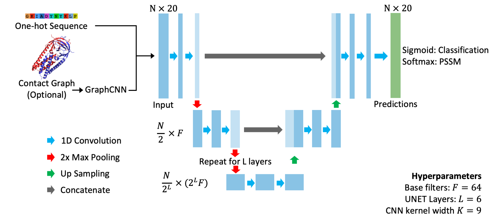

# Sequence UNET 1.0.3
<!-- badges: start -->
[](https://zenodo.org/badge/latestdoi/370484533)
[](https://sequence-unet.readthedocs.io/en/latest/?badge=latest)
<!-- badges: end -->

Sequence UNET is a fully convolutional neural network variant effect predictor, able to predict the pathogenicity of protein coding variants and the frequency they occur across large multiple sequence alignments.
A description and discussion of the model is available on bioRxiv [(Dunham et al. 2022)](https://www.biorxiv.org/content/10.1101/2022.05.23.493038).
It uses a U-shaped architecture inspired by the U-NET medical image segmentation network [(Ronneberger et al. 2015)](http://arxiv.org/abs/1505.04597), with an optional Graph CNN section to incorporate information from protein structure:



This repo contains a python package for downloading and using the trained models as well as code used to train, explore and analyse the models.
The package can download, load and predict with 8 variant trained models, which are also available for manual download on [BioStudies](https://www.ebi.ac.uk/biostudies/studies/S-BSST732).
The python package is contained in the `sequence_unet` directory, with documentation in the `docs` directory.
It is also possible to use the modules and scripts used for training and exploring different models, found in `analysis`, `bin` and `source`.
The python scripts and modules require adding the `src` directory to your python path.

## Installation

In most cases pip should be able to handle all the dependancies, meaning installation is simple:

`pip install sequence_unet`

Or the latest development version from GitHub:

`pip install git+https://github.com/allydunham/sequence_unet`

### Manual installation

If pip can't resolve the correct dependancies the requirements might be able to be installed manually:

1. Install Tensorflow (or tensorflow-macos on M1 Macs): `pip install tensorflow` or `pip install tensorflow-macos`
2. Install other PyPi requirements: `pip install numpy pandas biopython tqdm proteinnetpy`
3. Install Sequence UNET: `pip install --no-deps sequence_unet`

This was needed on M1 Macs before I updated `pyproject.toml` to use `tensorflow-macos` for those systems since no versions of Tensorflow were available which matched the requirements.
It might help similar compatibility issues too.

### Requirements

The python package requires:

* Python 3+
* Tensorflow 2.6+
* Numpy
* Pandas
* Biopython
* TQDM
* [ProteinNetPy](https://github.com/allydunham/proteinnetpy)

I have tried to maintain as broad requirements as possible but future changes, particularly in Tensorflow, may result in more restrictive version support.

Figure generation and performance analysis was performed in R 4.0, largely using [Tidyverse](https://www.tidyverse.org/) packages.
All R packages used are loaded in `src/config.R` or the top of the respective script.

## Basic Usage

Detailed [documentation](https://sequence-unet.readthedocs.io/en/latest/) of the modules functions and scripts are available on ReadTheDocs.

### Loading Models

Trained models are downloaded and loaded using the [sequence_unet.models](https://sequence-unet.readthedocs.io/en/latest/models.html) module, which also provides functions to initialise untrained models.
The loaded model is a TensorFlow Keras model, so easily interfaces with other code.

```python
from sequence_unet import models

# Download a trained model
model_path = models.download_trained_model("freq_classifier", root="models", model_format="tf")

# Load the downloaded model via its path. This function can also download the model if not found
model = models.load_trained_model(model=model_path)

# or via name and root
model = models.load_trained_model(model="freq_classifier", root="models")
model.summary()
```

### Prediction

The [sequence_unet.predict](https://sequence-unet.readthedocs.io/en/latest/predict.html) module provides functions to predict from sequences or ProteinNet files.
Other input data can easily be parsed into one of these formats or transformed in Python to fit the models input shapes (described in the [models.sequence_unet](https://sequence-unet.readthedocs.io/en/latest/models.html#sequence_unet.models.sequence_unet) function).

```python
from pandas import concat
from Bio import SeqIO
from proteinnetpy.data import ProteinNetDataset

from sequence_unet.models import load_trained_model
from sequence_unet.predict import predict_sequence, predict_proteinnet

# load a model
model = load_trained_model(model="freq_classifier", download=True)

# Predict from a fasta file
fasta = SeqIO.parse("path/to/fasta.fa", format="fasta")
preds = concat([p for p in predict_sequence(model, sequences=fasta, wide=True)])

# Predict from a ProteinNet file
data = ProteinNetDataset(path="path/to/proteinnet", preload=False)
preds = concat([p for p in predict_proteinnet(model, data, wide=True)])
```

The package also binds the `sequence_unet` command, which allows users to make predictions from the command line.
It supports predicting scores for proteins in a fasta or [ProteinNet](https://github.com/aqlaboratory/proteinnet/) file.
A full description is available in the [documentation](https://sequence-unet.readthedocs.io/en/latest/scripts.html) and can be accessed using `-h`.

### Training

The `sequence_unet` package does not include specific code for training new models, as the best way to do this will be specific to the users needs.
However, the loaded models are [TensorFlow Keras models](https://www.tensorflow.org/api_docs/python/tf/keras/Model) and inherently support straightforward and extensible training.
I used the `training.py` script to train the models, based on a saved model and data loading function saved by the `make_experiment_dir` function in `src/utils.py`.
Usage of the script is documented in it's docstring and can be accessed using `-h`.
The training scripts in subdirectories of `models` give examples of the model training procedures I used to train the various forms of the model.
This setup can be adapted for other users needs reasonably easily.
